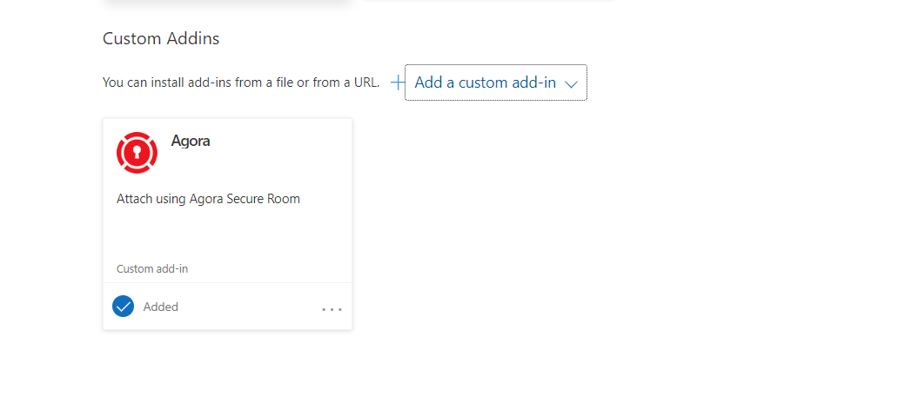

# Agora Outlook Add-in Deployment Guide

This guide will walk you through the process of serving your Outlook add-in directory, attaching the `manifest.xml` file in Outlook Web, and using the add-in.

## Prerequisites

- Node.js and npm installed on your machine.
- A valid SSL certificate and private key for serving the add-in over HTTPS.
- An Outlook Web account.

## Step 1: Generate SSL Certificate and Private Key

If you don't already have an SSL certificate and private key, you can generate a self-signed certificate using OpenSSL:

```bash
openssl req -new -newkey rsa:2048 -nodes -keyout server.key -out server.csr
openssl x509 -req -days 365 -in server.csr -signkey server.key -out server.cert
```

This will create `server.key` (private key) and `server.crt` (certificate) files in your current directory.

## Step 2: Install `serve`

If you haven't installed `serve` yet, install it globally using npm:

```bash
npm install -g serve
```

## Step 3: Serve the Outlook Add-in Directory

Navigate to your Outlook add-in directory and serve it over HTTPS using the generated SSL certificate and private key:

```bash
cd path/to/your/outlook-addin-directory
serve -l 3000 --ssl-cert server.cert --ssl-key server.key
```

By default, your add-in will be available at `https://localhost:3000`.

## Step 4: Attach the `manifest.xml` File in Outlook Web

1. **Log in to Outlook Web:**
   - Go to [Outlook Web](https://outlook.office.com/).
2. **Upload the `manifest.xml` File:**
   - Click on the New Email icon in the top-left corner.
   
   - Select "Insert"
      
   - Navigate to "Apps" > "Get add-ins" > "My Add-ins"
   
   
   - Click on the "+ Add a custom add-in" button to add a custom add-in.
   - Choose "Upload My Add-in."
   - Upload the `manifest.xml` file from your Outlook add-in directory.
   - refresh the outlook webpage
   
   

## Step 5: Use the Add-in in Outlook Web

Once the `manifest.xml` file is uploaded and the add-in is installed, you can start using it in Outlook Web:

- compose a new email.
- Look for the add-in icon in the ribbon inside "insert" > "Apps" .
- Click on the icon to sign in to Agora and attach files to the email you are composing.

## Troubleshooting

- **Self-Signed Certificate Warning:** Browsers will show a security warning when accessing a site with a self-signed certificate. This is normal for development purposes. You can proceed to the site by accepting the warning.
head to https://localhost:3000 and proceed after the antivirus warning and then you can access the add-in normally

- **changing the ip address or port:** If you want to serve your add-in on other address or another port you can do so by modifying the manifest.xml "change every https://localhost:3000 with your address and port" and then update the outlook by adding it from the beginning

## Conclusion

You have successfully served your Agora add-in directory over HTTPS, attached the `manifest.xml` file in Outlook Web, and started using the add-in. Enjoy your secure attachment Agora add-in!
